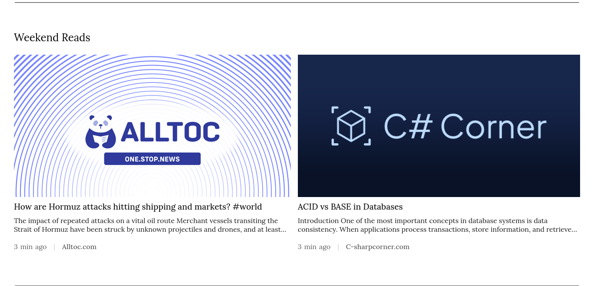
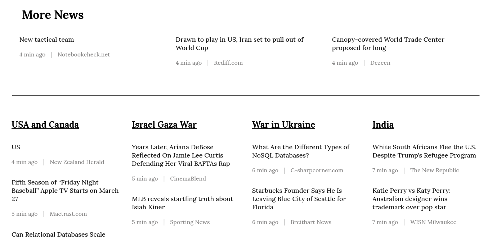

# 📰 News Aggregator


A modern **News Web App** that collects the latest headlines from multiple sources and presents them in a clean and user-friendly interface.

Stay updated with global news across categories like **Technology, Business, Sports, Entertainment, and more.**

---

## 🚀 Features

- 🗞️ Fetch latest news from external APIs  
- 📂 Browse news by category  
- 🔎 Search articles instantly  
- 📱 Fully responsive design  
- ⚡ Fast and smooth UI  

---

## 🛠 Tech Stack

| Layer | Technology |
|------|-------------|
| Frontend | React |
| Styling | CSS   |
| API | News API |
| Deployment | Vercel  |

---

## 📸 Preview






---

## 📦 Installation

Clone the repository

```bash
git clone https://github.com/yourusername/news.git
cd news
npm install 
npm run start
npm run dev

